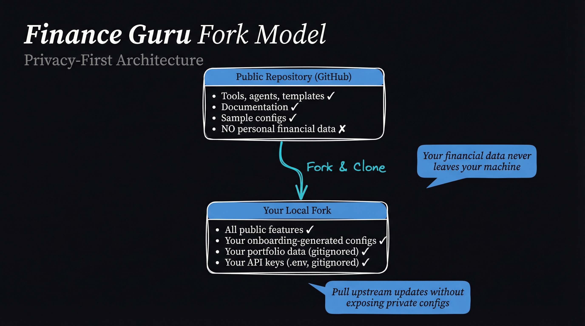

<p align="center">
  
</p>

<h1 align="center">Finance Guru™</h1>

<p align="center">
  <strong>Stop juggling 10 browser tabs for financial analysis.<br>One command activates 8 AI specialists who work together as your private family office.</strong>
</p>

<p align="center">
  <a href="https://github.com/ossieirondi/family-office/stargazers"></a>
  <a href="https://github.com/ossieirondi/family-office/network/members"></a>
</p>

<p align="center">
  <a href="https://www.python.org/downloads/"></a>
  <a href="https://claude.ai/claude-code"></a>
  <a href="#11-production-ready-analysis-tools"></a>
  <a href="#what-i-built"></a>
  <a href="#license"></a>
</p>

<p align="center">
  
</p>

---

## The Problem I Solved

I was drowning in complexity. Every investment decision meant:
- Opening Yahoo Finance for prices
- Switching to a spreadsheet for calculations
- Googling "how to calculate Sharpe ratio" (again)
- Copy-pasting data between 5 different tools
- Second-guessing myself because I couldn't see the full picture

**The real cost wasn't time—it was confidence.** I never felt certain my analysis was complete.

## The Insight

What if instead of me becoming an expert in everything, I could have a *team* of experts who already knew my portfolio, my risk tolerance, and my goals?

Not a chatbot. Not an app. A **personal family office** that treats me like a wealth management client—but built on AI agents that can actually run calculations.

## What I Built

Finance Guru™ is my private AI-powered family office. It's not software you install—it's a system where Claude transforms into specialized financial agents who work exclusively for me.

**One command:**
```bash
/finance-orchestrator
```

**Eight specialists activate:**

| Agent | Expertise | What They Do |
|-------|-----------|--------------|
| **Cassandra Holt** | Orchestrator | Coordinates the team, routes my requests |
| **Market Researcher** | Intelligence | Scans markets, identifies opportunities |
| **Quant Analyst** | Data Science | Runs calculations, builds models |
| **Strategy Advisor** | Portfolio | Optimizes allocations, validates strategies |
| **Compliance Officer** | Risk | Checks position limits, flags concerns |
| **Margin Specialist** | Leverage | Analyzes margin strategies safely |
| **Dividend Specialist** | Income | Optimizes yield, tracks distributions |
| **Tax Optimizer** | Efficiency | Structures holdings for tax advantage |

## See It In Action

**Me:** "Should I add more TSLA to my portfolio?"

**What happens behind the scenes:**
```bash
# Market Researcher checks momentum
uv run python src/utils/momentum_cli.py TSLA --days 90

# Quant Analyst calculates risk metrics
uv run python src/analysis/risk_metrics_cli.py TSLA --days 90 --benchmark SPY

# Quant Analyst checks market-implied risk
uv run python src/analysis/itc_risk_cli.py TSLA --universe tradfi

# Strategy Advisor checks correlation with existing holdings
uv run python src/analysis/correlation_cli.py TSLA PLTR NVDA --days 90

# Compliance Officer validates position size
# → Checks if addition exceeds concentration limits
```

**What I get:** A coordinated answer that considers momentum, risk, correlation, and compliance—not just a single data point.

## The Technical Foundation

### 11 Production-Ready Analysis Tools

Every tool follows the same bulletproof pattern:

```
Pydantic Models → Calculator Classes → CLI Interfaces
     ↓                    ↓                  ↓
 Type Safety         Business Logic      Agent Access
```

| Category | Tools | Key Metrics |
|----------|-------|-------------|
| **Risk** | Risk Metrics, ITC Risk | VaR, CVaR, Sharpe, Sortino, Max Drawdown, Beta, Alpha |
| **Technical** | Momentum, Moving Averages, Volatility | RSI, MACD, Golden Cross, Bollinger Bands, ATR |
| **Portfolio** | Correlation, Optimizer, Backtester | Diversification score, Max Sharpe, Risk Parity |
| **Options** | Options Pricer | Black-Scholes, Greeks, Implied Volatility |

### External Risk Intelligence

**ITC Risk Models API** integration provides market-implied risk scores:
- Real-time risk assessment for TSLA, AAPL, MSTR, NFLX, SP500, commodities
- Risk bands help agents validate entry/exit timing
- Complements internal quant metrics with external perspective

## Quick Start

**For complete installation instructions, see [docs/SETUP.md](docs/SETUP.md)**

### Prerequisites
```bash
# Claude Code (the orchestration platform)
curl -fsSL https://claude.ai/install.sh | bash

# Python 3.12+ with uv package manager
curl -LsSf https://astral.sh/uv/install.sh | sh

# Bun (for onboarding and hooks)
curl -fsSL https://bun.sh/install | bash

# Docker (optional, for Google Drive MCP)
# Install from https://docs.docker.com/get-docker/
```

### Setup

```bash
# 1. Fork and clone the repository
git clone https://github.com/YOUR-USERNAME/family-office.git
cd family-office

# 2. Run the setup script
./setup.sh
```

The setup script will:
- Create your private documentation directories
- Set up portfolio data folders
- Create user profile template
- Install Python dependencies
- Load Finance Guru agent commands (symlinks to ~/.claude/commands/fin-guru)
- Load Finance Guru skills (9 skills linked to ~/.claude/skills/)
- Run interactive onboarding wizard

**Need help?** See the [complete setup guide](docs/SETUP.md) for troubleshooting and configuration details.

### What Gets Installed

The setup script symlinks Finance Guru components to your global Claude Code configuration:

**Agent Commands** (→ `~/.claude/commands/fin-guru/`):
- `/fin-guru:agents:finance-orchestrator` - Main orchestrator (Cassandra Holt)
- `/fin-guru:agents:market-researcher` - Market intelligence specialist
- `/fin-guru:agents:quant-analyst` - Quantitative analysis specialist
- `/fin-guru:agents:strategy-advisor` - Portfolio strategy specialist
- `/fin-guru:agents:compliance-officer` - Risk and compliance specialist
- `/fin-guru:agents:margin-specialist` - Leverage analysis specialist
- `/fin-guru:agents:dividend-specialist` - Income optimization specialist
- `/fin-guru:agents:onboarding-specialist` - First-time setup guide

**Skills** (→ `~/.claude/skills/`):
- `fin-core` - Core Finance Guru system context
- `margin-management` - Margin Dashboard integration
- `PortfolioSyncing` - Fidelity CSV → Google Sheets sync
- `MonteCarlo` - Monte Carlo simulation runner
- `retirement-syncing` - Retirement account sync (Vanguard/Fidelity)
- `dividend-tracking` - Dividend data sync
- `FinanceReport` - PDF analysis report generator
- `TransactionSyncing` - Transaction history import
- `formula-protection` - Spreadsheet formula protection

These symlinks allow you to use Finance Guru commands and skills from any Claude Code session.

### Onboarding (First Time Users)

**Important:** Run the Onboarding Specialist before using Finance Guru.

```bash
# Start Claude Code in the project
claude

# Activate the Onboarding Specialist
/fin-guru:agents:onboarding-specialist
```

The Onboarding Specialist will guide you through:
1. Financial assessment questionnaire
2. Portfolio profile creation
3. Risk tolerance configuration
4. Strategy recommendations

### After Onboarding

Once your profile is set up, activate the full Finance Guru system:

```bash
# Activate Finance Guru
/fin-guru:agents:finance-orchestrator

# Or go direct to a specialist
*quant            # "Analyze TSLA risk profile"
*strategy         # "Optimize my portfolio allocation"
*market-research  # "What's the momentum on NVDA?"
```

## 🍴 Fork Model: Use Finance Guru Safely

Finance Guru is designed to be **forked** and used privately. Here's how it works:

### Architecture for Privacy

<p align="center">
  
</p>

### How to Use

1. **Fork this repository** to your GitHub account
2. **Clone to your machine** (never commit personal data)
3. **Run onboarding** to generate your private configs
4. **Pull upstream updates** safely (configs in .gitignore)

### What's Tracked vs. Ignored

**Tracked (safe to commit):**
- ✅ Tools (`src/`, `scripts/`)
- ✅ Agent definitions (`fin-guru/agents/`)
- ✅ Templates (`scripts/onboarding/modules/templates/`)
- ✅ Documentation (`docs/`, `README.md`)
- ✅ Package files (`pyproject.toml`, `package.json`)

**Ignored (private data):**
- 🔒 `fin-guru/data/user-profile.yaml` (your financial data)
- 🔒 `notebooks/updates/*.csv` (your account exports)
- 🔒 `.env` (your API keys)
- 🔒 `fin-guru-private/` (your private strategies)

### Updating Your Fork

```bash
# Add upstream remote (one-time)
git remote add upstream https://github.com/ORIGINAL-AUTHOR/family-office.git

# Pull updates (safe - won't touch your private configs)
git fetch upstream
git merge upstream/main

# Your private data stays untouched
```

### Security Checklist

Before pushing to GitHub:

```bash
# Verify private files are ignored
git status --ignored

# Ensure no sensitive data in commit
git diff --cached

# Check .env is ignored
ls -la .env  # Should show file exists locally
git check-ignore .env  # Should output ".env" (confirmed ignored)
```

## Project Structure

```
family-office/
├── src/                      # Analysis engine (11 tools)
│   ├── analysis/             # Risk, correlation, options, ITC Risk
│   ├── strategies/           # Backtester, optimizer
│   ├── utils/                # Momentum, volatility, validators
│   └── models/               # Pydantic type definitions
├── fin-guru/                 # Agent system
│   ├── agents/               # 8 specialist definitions
│   ├── tasks/                # Workflow configurations
│   └── data/                 # Knowledge base & templates
└── tests/                    # Test suite
```

## Why This Approach Works

**Traditional tools** give you data. Finance Guru gives you **judgment**.

The difference:
- A stock screener tells you RSI is 75
- Finance Guru tells you "RSI is overbought, but your portfolio is underweight tech, and Compliance says you have room for a small position if Quant's risk metrics confirm"

**It's the coordination that creates value**—not any single calculation.

## Security & Privacy

- All data stays local on my machine
- No external access to financial information
- Portfolio data never leaves this repository
- This is a private system, not a service

## Built With

- **Claude Code** - Multi-agent orchestration
- **Python 3.12** - Analysis engine
- **Pydantic** - Type-safe validation
- **yfinance** - Market data
- **pandas/numpy/scipy** - Calculations
- **ITC Risk Models** - External risk intelligence

## Context Management

Finance Guru is designed for **token efficiency**. Even with extensive startup context injection, you retain ample room for complex analysis.

### Typical Session Context Usage

| Component | Tokens | % of 200k |
|-----------|--------|-----------|
| System prompt | 3.8k | 1.9% |
| System tools | 17.8k | 8.9% |
| MCP tools | 1.5k | 0.8% |
| Custom agents | 1.0k | 0.5% |
| Memory files (CLAUDE.md) | 2.5k | 1.2% |
| Skills | 3.6k | 1.8% |
| Messages | 22.2k | 11.1% |
| **Free space** | **103k** | **51.3%** |
| Autocompact buffer | 45.0k | 22.5% |

**Key insight**: With Finance Guru context auto-loaded at session start, you still have **51% free context** for actual work.

### Why This Works

1. **CLI-First Architecture**: Heavy computation happens in Python CLI tools, not in context. When you run `risk_metrics_cli.py`, the calculation happens outside the token window.

2. **Session Start Hooks**: The `load-fin-core-config.ts` hook injects:
   - System configuration
   - User profile with portfolio strategy
   - Latest Fidelity balances and positions
   - fin-core skill content

3. **Skills Auto-Activate**: Instead of loading all domain knowledge upfront, skills load on-demand based on your prompts and file paths.

4. **Structured Context**: YAML configs and markdown docs compress well and are easy for Claude to parse.

See [docs/hooks.md](docs/hooks.md) for details on the hooks system.

## Requirements

### Required MCP Servers

These MCP servers must be configured for Finance Guru to function:

| MCP Server | Purpose | Required For |
|------------|---------|--------------|
| **exa** | Market research, intelligence gathering | Market Researcher agent, web searches |
| **bright-data** | Web scraping, data extraction | Alternative data sources, live data |
| **sequential-thinking** | Complex financial reasoning | Multi-step analysis workflows |

### Optional MCP Servers

Enhance functionality but not required:

| MCP Server | Purpose | Use Case |
|------------|---------|----------|
| **gdrive** | Google Sheets integration | Portfolio tracking, DataHub sync |
| **perplexity** | AI-powered search with citations | Deep research, market analysis |
| **financial-datasets** | Real-time market data | Live price feeds |
| **context7** | Documentation lookup | Framework reference |
| **nano-banana** | Image generation | Chart visualization |

### Optional APIs

All market data is fetched via yfinance by default. These APIs are optional enhancements:

| API | Purpose | Get Key |
|-----|---------|---------|
| **Finnhub** | Real-time intraday prices | [finnhub.io](https://finnhub.io/) (free tier: 60 calls/min) |
| **ITC Risk Models** | External risk intelligence | Contact ITC directly |
| OpenAI | Alternative LLM for specific tasks | [platform.openai.com](https://platform.openai.com/) |

### Environment Setup

```bash
# Copy example env file
cp .env.example .env

# Edit with your API keys (all optional - yfinance works without keys)
FINNHUB_API_KEY=your_key_here    # For real-time prices
ITC_API_KEY=your_key_here        # For ITC risk scores
```

## Documentation

| Document | Description |
|----------|-------------|
| [docs/index.md](docs/index.md) | Documentation hub |
| [docs/SETUP.md](docs/SETUP.md) | **Complete setup guide** (start here) |
| [docs/api-keys.md](docs/api-keys.md) | **API key acquisition guide** |
| [docs/TROUBLESHOOTING.md](docs/TROUBLESHOOTING.md) | **Comprehensive troubleshooting** |
| [docs/api.md](docs/api.md) | CLI tools reference |
| [docs/hooks.md](docs/hooks.md) | Hooks system documentation |
| [docs/contributing.md](docs/contributing.md) | Contribution guidelines |
| [fin-guru/README.md](fin-guru/README.md) | Finance Guru module documentation |

**Note:** After running `setup.sh`, your personal strategies and analysis will be in `fin-guru-private/` (gitignored).

## Educational Disclaimer

Finance Guru™ is for educational purposes only. This is not investment advice. All investments carry risk, including potential loss of principal. Always consult licensed financial professionals before making investment decisions.

## License

Finance Guru is free software licensed under the **GNU Affero General Public License v3.0 (AGPLv3)**.

### What This Means for You

**You are free to:**
- ✅ **Use** Finance Guru for any purpose (personal, commercial, educational)
- ✅ **Study** the source code and understand how it works
- ✅ **Modify** the code to suit your needs
- ✅ **Share** copies with others
- ✅ **Distribute** your modifications

**Under these conditions:**
- 📖 **Source code must remain open** (copyleft) - derivatives must use AGPLv3
- 🌐 **Network users get source access** - if you run Finance Guru as a service, users must be able to get the source
- 📝 **Changes must be documented** - state what you modified and when
- 🔄 **Same license for derivatives** - any modifications must also be AGPLv3

### Why AGPLv3?

AGPLv3 is the strongest copyleft license, designed specifically for server software. It ensures:

1. **Community Protection**: Prevents companies from taking this code, modifying it, running it as a SaaS, and keeping improvements private
2. **Transparency**: Anyone using Finance Guru (especially financial analysis tools) can audit the code
3. **Freedom Forever**: Guarantees the software stays free and open for all future users

### Network Copyleft (Section 13)

The key difference from regular GPL: If you run a modified version of Finance Guru on a server and let people interact with it over a network, **you must provide them with the source code**.

This prevents the "cloud loophole" where someone could use your work without contributing back.

### Compatible With

- **Other AGPLv3 projects**: Freely combine
- **GPLv3 projects**: Compatible (see Section 13 of license)
- **Permissive licenses** (MIT, Apache, BSD): Can be included in AGPLv3 projects

### Not Compatible With

- ❌ Proprietary/closed-source projects cannot include Finance Guru code
- ❌ GPL v2-only projects (but GPLv2-or-later is compatible via GPLv3)

### Full License Text

See [LICENSE](LICENSE) for the complete legal terms.

### Questions?

- **"Can I use this for my business?"** Yes! AGPLv3 allows commercial use.
- **"Do I need to open-source my portfolio data?"** No. Your data isn't part of the software.
- **"Can I sell Finance Guru?"** Yes, but you must provide source code to buyers.
- **"Can I make a proprietary fork?"** No. All derivatives must be AGPLv3.

For more on AGPLv3, see the [GNU project page](https://www.gnu.org/licenses/agpl-3.0.html).

## Star History

If you find Finance Guru useful, please ⭐ star the repo to help others discover it!

[](https://star-history.com/#AojdevStudio/Finance-Guru&Date)

---

<p align="center">
  <strong>Finance Guru™ v2.0.0</strong><br>
  My AI-powered family office, working exclusively for me.
</p>

<p align="center">
  <sub>If Finance Guru helps you, please ⭐ star the repo!</sub>
</p>
